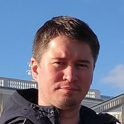

1. Anton Andreev
2. E-mail: *obsos32@gmail.com*, Discord server rs school: *Andreev Anton (@anton-kim)*
3. Worked for a long time as a labor protection specialist, always actively engaged in automation of work processes in Excel, Microsoft Access, etc. As a result, I decided to "let go" of this area and test myself in programming, because the topic of IT in all its guises has always attracted my attention one way or another (3D modeling and further rendering/video rendering, creating websites, flash videos, plug-ins for computer games, videos, etc.). Now almost any the industry cannot imagine itself without IT. For me it is important and close. Therefore, I would like to become a part of the IT community. I think my main soft skills are: a crazy sense of responsibility and a desire to automate processes.
4. Skills: ***Python***, ***Django Framework***, ***Rest API***.
5. A function that returns the count of passed arguments:
```python
def args_count(*args, **kwargs):
    return len(args) + len(kwargs)
```
6. Refrigeration equipment repairman (2009 - 2012), Occupational safety specialist (2012 - 2022), Python developer (learning) (from 2022). Projects: https://github.com/Anton-Kim/my_buh
7. Russian State Social University (specialist), Professional Training Center: courses on 3D MAX + Vray, Yandex Practicum: Python developer.
8. English: A2.