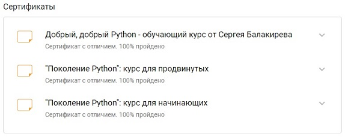

# Andreev Anton


---

### Contacts:
**E-mail:** obsos32@gmail.com<br>
**Telegram:** @anton_kim<br>
**RS School Discord server :** Andreev Anton (@anton-kim)<br>
[LinkedIn](https://www.linkedin.com/in/anton-andreev-675428161/)

---

### Brief about myself:
Worked for a long time as a labor protection specialist, always actively engaged in automation of work processes in Excel, Microsoft Access, etc. As a result, I decided to "let go" of this area and test myself in programming, because the topic of IT in all its guises has always attracted my attention one way or another (3D modeling and further rendering/video rendering, creating websites, flash videos, plug-ins for computer games, videos, etc.).<br>

Now almost any the industry cannot imagine itself without IT. For me it is important and close. Therefore, I would like to become a part of the IT community.<br>

I think my main soft skills are: a crazy sense of responsibility and a desire to automate processes.

---

### Skills:
- Python
- Django Framework
- Rest API
- Git, GitHub
- PyCharm

---

### Code example:
A function that returns the count of passed arguments:
```python
def args_count(*args, **kwargs):
    return len(args) + len(kwargs)
```

---

### Work experience:
- [Foodgram Project](https://github.com/Anton-Kim/foodgram-project-react) (Yandex Practicum)
- [My Accounting Project](https://github.com/Anton-Kim/my_buh)
- [Group YaMDb Project](https://github.com/Anton-Kim/api_yamdb) (Yandex Practicum)

---

### Education and courses:
- JavaScript Manual on [learnjavascript.ru](https://learn.javascript.ru/) (in progress)
- RS Schools Course «JavaScript/Front-end. Stage 0» (in progress)
- Python courses on [stepik.org](https://stepik.org/)<br>
- Python developer (Yandex Practicum, 2022)
- Professional Training Center (Moscow): courses on 3D MAX + Vray (2012)

---

### Languages:
- English - A2
- Russian - Native